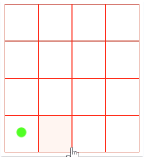

# ChainReaction

## General Rule

- Each Cell Can Hold Only One Type Of Orbs
- A player can't place orbs on other player cells 
- A minimum of 2 Players is required to play
- Player Chance Comes is Like a Queue
- Example: Suppose you Choose 3 Player 
- If Player Order  Is : [1,2,3], the chance will be [1,2,3,1,2,3,..] 
- Suppose 2 Got Eliminated while Player 1 was playing 
- Then Order is [1,3,1,3,1,3,1,3,..]
- The last Standing Player will be a winner. 

## Corner Cells behaviour
 
- Each Corner Cell can hold Only One Orb
- On Placing another orb, it will burst
- Empty its place and take over the adjacent 
- vertically and horizontal neighbor cells 
- A total of Two Cells 

## Edge Cells behaviour
 
- Each Edge Cell can hold up to two Orbs
- On Placing the third orb, it will burst
- Empty its place and take over the adjacent 
- vertically and horizontal neighbor cells
- A total of Three Cells 

## Rest Cells behaviour
 
- Cells Other than Corner and Edge can hold up to three Orbs
- On Placing four orb, it will burst
- Empty its place and take over the adjacent 
- vertically and horizontal neighbor cells
- A total of four Cells 